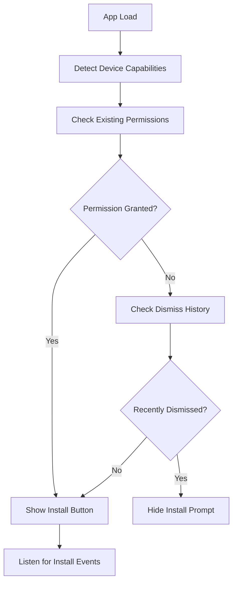
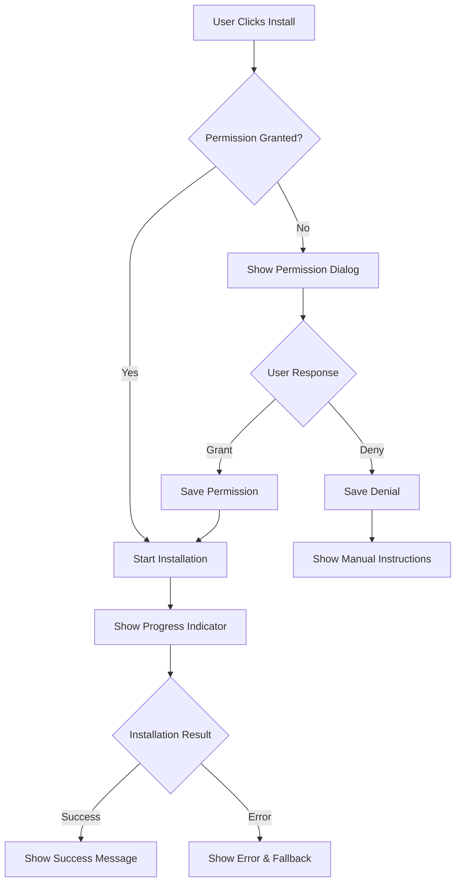
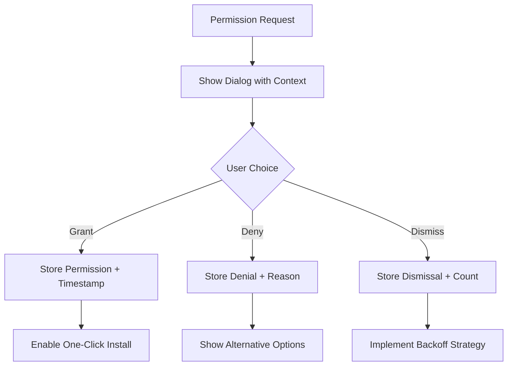

# Design Document

## Overview

ออกแบบระบบ One-Click PWA Installation ที่ปรับปรุงจากระบบเดิม โดยเพิ่มความสามารถในการจดจำการอนุญาตของผู้ใช้และลดขั้นตอนการติดตั้งให้เหลือเพียงคลิกเดียว ระบบจะใช้ localStorage และ user preferences เพื่อจัดเก็บสถานะการอนุญาต และปรับปรุง UX ให้สะดวกและรวดเร็วยิ่งขึ้น

## Architecture

### Component Structure
```
OneClickInstallProvider
├── InstallButton (Enhanced)
├── PermissionDialog (New)
├── InstallationProgress (New)
└── InstallationSuccess (New)
```

### State Management
- **Installation State**: `idle | requesting-permission | installing | success | error`
- **Permission State**: `unknown | granted | denied | dismissed`
- **Device Detection**: `android | ios | desktop | unsupported`

### Storage Strategy
- **localStorage**: เก็บ permission state และ user preferences
- **sessionStorage**: เก็บ temporary installation state
- **IndexedDB**: เก็บ installation analytics (optional)

## Components and Interfaces

### 1. OneClickInstallProvider
```typescript
interface OneClickInstallState {
  installationState: 'idle' | 'requesting-permission' | 'installing' | 'success' | 'error';
  permissionState: 'unknown' | 'granted' | 'denied' | 'dismissed';
  deviceType: 'android' | 'ios' | 'desktop' | 'unsupported';
  canInstall: boolean;
  deferredPrompt: BeforeInstallPromptEvent | null;
  error?: string;
}

interface OneClickInstallActions {
  requestInstallation: () => Promise<void>;
  resetPermissions: () => void;
  dismissInstallPrompt: () => void;
  trackInstallEvent: (event: string, data?: any) => void;
}
```

### 2. Enhanced InstallButton
```typescript
interface InstallButtonProps {
  variant?: 'primary' | 'secondary' | 'floating';
  size?: 'sm' | 'md' | 'lg';
  showTooltip?: boolean;
  autoHide?: boolean;
  position?: 'fixed' | 'relative';
}
```

### 3. PermissionDialog
```typescript
interface PermissionDialogProps {
  isOpen: boolean;
  onGrant: () => void;
  onDeny: () => void;
  deviceType: DeviceType;
}
```

### 4. InstallationProgress
```typescript
interface InstallationProgressProps {
  isVisible: boolean;
  progress: number;
  message: string;
}
```

## Data Models

### InstallationPreferences
```typescript
interface InstallationPreferences {
  permissionGranted: boolean;
  lastPromptDate: string;
  dismissCount: number;
  autoInstallEnabled: boolean;
  deviceFingerprint: string;
  userId?: string;
}
```

### InstallationAnalytics
```typescript
interface InstallationEvent {
  eventType: 'prompt_shown' | 'button_clicked' | 'permission_granted' | 'install_success' | 'install_failed';
  timestamp: string;
  deviceType: string;
  userAgent: string;
  sessionId: string;
  userId?: string;
  metadata?: Record<string, any>;
}
```

### DeviceCapabilities
```typescript
interface DeviceCapabilities {
  supportsBeforeInstallPrompt: boolean;
  supportsServiceWorker: boolean;
  supportsWebShare: boolean;
  isStandalone: boolean;
  platform: string;
  installMethod: 'native' | 'manual' | 'unsupported';
}
```

## Error Handling

### Error Types
```typescript
enum InstallationError {
  PERMISSION_DENIED = 'permission_denied',
  BROWSER_NOT_SUPPORTED = 'browser_not_supported',
  ALREADY_INSTALLED = 'already_installed',
  NETWORK_ERROR = 'network_error',
  UNKNOWN_ERROR = 'unknown_error'
}
```

### Error Recovery Strategies
1. **Permission Denied**: แสดง manual installation instructions
2. **Browser Not Supported**: แสดง alternative installation methods
3. **Already Installed**: ซ่อน install button และแสดง success state
4. **Network Error**: retry mechanism พร้อม exponential backoff
5. **Unknown Error**: fallback ไปใช้ manual installation

### Graceful Degradation
- iOS Safari: แสดง step-by-step instructions
- Firefox: แสดง bookmark suggestion
- Older browsers: แสดง "Add to favorites" option

## Testing Strategy

### Unit Tests
- Component rendering และ state management
- Utility functions สำหรับ device detection
- Permission handling logic
- Analytics tracking functions

### Integration Tests
- End-to-end installation flow
- Cross-browser compatibility
- Device-specific behavior
- Storage persistence

### User Acceptance Tests
- Installation success rate measurement
- User experience testing across devices
- Performance impact assessment
- Accessibility compliance testing

### Test Scenarios
```typescript
describe('One-Click Installation', () => {
  describe('First-time user', () => {
    it('should show permission dialog on first install attempt');
    it('should remember permission after granting');
    it('should install immediately on subsequent clicks');
  });

  describe('Returning user', () => {
    it('should skip permission dialog if previously granted');
    it('should respect denied permission');
    it('should allow permission reset');
  });

  describe('Device-specific behavior', () => {
    it('should use native prompt on supported browsers');
    it('should show manual instructions on iOS');
    it('should handle unsupported browsers gracefully');
  });
});
```

## Implementation Flow

### 1. Initialization Flow


### 2. Installation Flow


### 3. Permission Management Flow


## Performance Considerations

### Lazy Loading
- Load installation components only when needed
- Defer analytics tracking until after installation
- Use dynamic imports for device-specific code

### Caching Strategy
- Cache device capabilities detection results
- Store permission state in localStorage
- Use sessionStorage for temporary installation state

### Bundle Size Optimization
- Tree-shake unused device detection code
- Minimize analytics payload
- Use compression for stored preferences

### Memory Management
- Clean up event listeners on unmount
- Dispose of deferred prompt after use
- Limit analytics event queue size

## Security Considerations

### Data Privacy
- ไม่เก็บ sensitive user information
- Hash device fingerprints
- Respect user's privacy preferences
- Comply with GDPR/privacy regulations

### Permission Validation
- Validate permission state before installation
- Prevent permission spoofing
- Implement rate limiting for install attempts
- Sanitize analytics data

### Cross-Site Security
- Use secure storage methods
- Validate origin before installation
- Prevent clickjacking attacks
- Implement CSP headers

## Analytics and Monitoring

### Key Metrics
- Installation conversion rate
- Permission grant rate
- Device-specific success rates
- Time to installation completion
- Error frequency by type

### Event Tracking
```typescript
// Installation funnel events
trackEvent('install_prompt_shown', { deviceType, timestamp });
trackEvent('install_button_clicked', { hasPermission, timestamp });
trackEvent('permission_requested', { isFirstTime, timestamp });
trackEvent('permission_granted', { timestamp });
trackEvent('installation_started', { method, timestamp });
trackEvent('installation_completed', { duration, timestamp });
trackEvent('installation_failed', { error, timestamp });
```

### Performance Monitoring
- Installation completion time
- Permission dialog response time
- Component render performance
- Storage operation latency

ระบบนี้จะทำให้การติดตั้ง PWA เป็นเรื่องง่ายและรวดเร็วขึ้น โดยลดขั้นตอนการยืนยันและเพิ่มประสบการณ์ผู้ใช้ที่ดีขึ้น