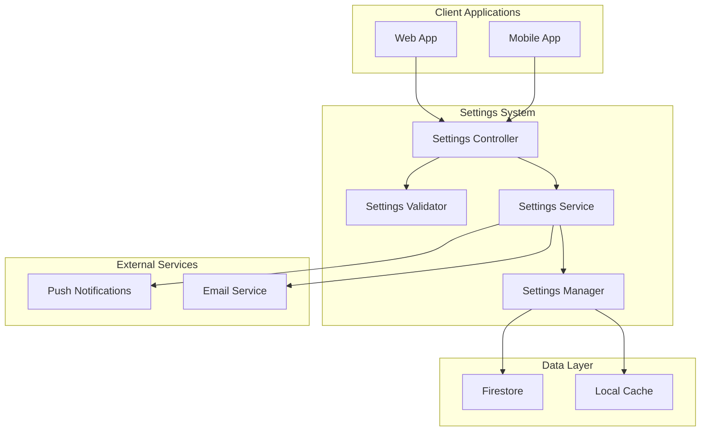

# Settings System Design Document

## Overview

The settings system will provide a comprehensive, role-based configuration interface for the marketplace application. It will support different user types (shoppers, vendors, drivers, admins) with appropriate settings for each role, while maintaining consistency across web and mobile platforms. The system will use Firebase Firestore for data persistence and real-time synchronization.

## Architecture

### High-Level Architecture



### Component Architecture

The settings system will be organized into the following layers:

1. **Presentation Layer**: React components for web and React Native components for mobile
2. **Business Logic Layer**: Settings services and validation logic
3. **Data Access Layer**: Firebase integration and caching mechanisms
4. **Storage Layer**: Firestore collections and local storage

## Components and Interfaces

### Core Components

#### 1. Settings Manager (`SettingsManager`)

```typescript
interface SettingsManager {
  getUserSettings(userId: string, role: UserRole): Promise<UserSettings>;
  updateUserSettings(userId: string, settings: Partial<UserSettings>): Promise<void>;
  resetUserSettings(userId: string, categories?: string[]): Promise<void>;
  exportUserSettings(userId: string): Promise<SettingsExport>;
  validateSettings(settings: Partial<UserSettings>): ValidationResult;
  syncSettings(userId: string): Promise<void>;
}
```

#### 2. Settings Service (`SettingsService`)

```typescript
interface SettingsService {
  getDefaultSettings(role: UserRole): DefaultSettings;
  applySettingsChange(userId: string, key: string, value: any): Promise<void>;
  notifySettingsChange(userId: string, changes: SettingsChange[]): Promise<void>;
  getSettingsSchema(role: UserRole): SettingsSchema;
}
```

#### 3. Settings Components

**Web Components:**
- `SettingsLayout`: Main settings page layout
- `SettingsNavigation`: Settings category navigation
- `SettingSection`: Individual setting sections
- `SettingItem`: Individual setting controls

**Mobile Components:**
- `SettingsScreen`: Main settings screen
- `SettingsGroup`: Grouped settings sections
- `SettingRow`: Individual setting rows
- `SettingModal`: Modal for complex settings

### Settings Categories

#### 1. User Profile Settings
- Personal information
- Avatar and display preferences
- Contact information
- Language and localization

#### 2. Notification Settings
- Push notifications
- Email notifications
- SMS notifications
- Notification timing preferences

#### 3. Privacy Settings
- Data sharing preferences
- Location sharing
- Profile visibility
- Activity tracking

#### 4. Role-Specific Settings

**Shopper Settings:**
- Delivery preferences
- Payment methods
- Order history preferences
- Favorite vendors

**Vendor Settings:**
- Business profile
- Operating hours
- Product management preferences
- Financial settings

**Driver Settings:**
- Availability schedule
- Vehicle information
- Job preferences
- Earnings settings

**Admin Settings:**
- System configuration
- Platform policies
- Fee structures
- User management
- Mobile app appearance management

## Data Models

### Core Settings Types

```typescript
interface UserSettings {
  userId: string;
  role: UserRole;
  profile: ProfileSettings;
  notifications: NotificationSettings;
  privacy: PrivacySettings;
  roleSpecific: RoleSpecificSettings;
  preferences: PreferenceSettings;
  createdAt: Timestamp;
  updatedAt: Timestamp;
  version: number;
}

interface ProfileSettings {
  displayName: string;
  avatar?: string;
  language: string;
  timezone: string;
  currency: string;
  theme: 'light' | 'dark' | 'system';
}

interface NotificationSettings {
  push: {
    enabled: boolean;
    orders: boolean;
    promotions: boolean;
    system: boolean;
    quietHours: {
      enabled: boolean;
      start: string;
      end: string;
    };
  };
  email: {
    enabled: boolean;
    orders: boolean;
    promotions: boolean;
    newsletter: boolean;
    frequency: 'immediate' | 'daily' | 'weekly';
  };
  sms: {
    enabled: boolean;
    orders: boolean;
    security: boolean;
  };
}

interface PrivacySettings {
  dataSharing: boolean;
  locationSharing: boolean;
  profileVisibility: 'public' | 'private' | 'friends';
  activityTracking: boolean;
  analytics: boolean;
}

interface ShopperSettings {
  defaultDeliveryAddress?: string;
  paymentPreferences: {
    defaultMethod?: string;
    saveCards: boolean;
    autoReorder: boolean;
  };
  orderPreferences: {
    confirmationRequired: boolean;
    substituteItems: boolean;
    deliveryInstructions?: string;
  };
}

interface VendorSettings {
  businessProfile: {
    businessName: string;
    description: string;
    logo?: string;
    banner?: string;
    businessHours: BusinessHours[];
    contactInfo: ContactInfo;
  };
  operationalSettings: {
    autoAcceptOrders: boolean;
    preparationTime: number;
    deliveryRadius: number;
    minimumOrder: number;
  };
  financialSettings: {
    payoutSchedule: 'daily' | 'weekly' | 'monthly';
    taxSettings: TaxSettings;
  };
}

interface DriverSettings {
  availability: {
    schedule: AvailabilitySchedule[];
    autoAcceptJobs: boolean;
    maxJobsPerHour: number;
  };
  vehicleInfo: {
    type: 'motorcycle' | 'car' | 'bicycle';
    licensePlate: string;
    insurance: InsuranceInfo;
  };
  jobPreferences: {
    maxDistance: number;
    preferredAreas: string[];
    jobTypes: string[];
  };
}

interface AdminSettings {
  systemConfig: {
    maintenanceMode: boolean;
    registrationEnabled: boolean;
    featuresEnabled: string[];
  };
  platformPolicies: {
    commissionRate: number;
    deliveryFee: number;
    cancellationPolicy: string;
  };
  integrations: {
    paymentGateways: PaymentGatewayConfig[];
    notificationServices: NotificationServiceConfig[];
  };
  mobileAppearance: {
    splashScreen: {
      backgroundImage?: string;
      backgroundColor: string;
      logoImage?: string;
      logoPosition: 'center' | 'top' | 'bottom';
      showLoadingIndicator: boolean;
    };
    branding: {
      primaryLogo?: string;
      secondaryLogo?: string;
      appIcon?: string;
      brandColors: {
        primary: string;
        secondary: string;
        accent: string;
      };
    };
    theme: {
      defaultTheme: 'light' | 'dark' | 'system';
      customThemes?: CustomTheme[];
    };
  };
}
```

### Firestore Collections Structure

```
/settings/{userId}
  - userId: string
  - role: string
  - profile: ProfileSettings
  - notifications: NotificationSettings
  - privacy: PrivacySettings
  - roleSpecific: RoleSpecificSettings
  - preferences: PreferenceSettings
  - createdAt: timestamp
  - updatedAt: timestamp
  - version: number

/settingsDefaults/{role}
  - role: string
  - defaultSettings: DefaultSettings
  - schema: SettingsSchema
  - updatedAt: timestamp

/settingsAudit/{userId}/changes/{changeId}
  - userId: string
  - changeId: string
  - changes: SettingsChange[]
  - timestamp: timestamp
  - source: 'web' | 'mobile'

/mobileAppearance
  - splashScreen: SplashScreenConfig
  - branding: BrandingConfig
  - theme: ThemeConfig
  - updatedAt: timestamp
  - version: number

/mobileAssets/{assetId}
  - assetId: string
  - type: 'splash_background' | 'logo' | 'app_icon'
  - url: string
  - metadata: ImageMetadata
  - uploadedAt: timestamp
```

## Error Handling

### Error Types

```typescript
enum SettingsErrorType {
  VALIDATION_ERROR = 'VALIDATION_ERROR',
  PERMISSION_DENIED = 'PERMISSION_DENIED',
  NETWORK_ERROR = 'NETWORK_ERROR',
  SYNC_CONFLICT = 'SYNC_CONFLICT',
  STORAGE_ERROR = 'STORAGE_ERROR'
}

interface SettingsError {
  type: SettingsErrorType;
  message: string;
  field?: string;
  code?: string;
  retryable: boolean;
}
```

### Error Handling Strategy

1. **Validation Errors**: Show inline field errors with clear messages
2. **Network Errors**: Implement retry logic with exponential backoff
3. **Sync Conflicts**: Use last-write-wins with user notification
4. **Permission Errors**: Redirect to appropriate authentication flow
5. **Storage Errors**: Fallback to local storage with sync when available

### Offline Support

- Cache settings locally using AsyncStorage (mobile) or localStorage (web)
- Queue setting changes when offline
- Sync changes when connection is restored
- Show offline indicator and cached data status

## Testing Strategy

### Unit Testing

1. **Settings Manager Tests**
   - CRUD operations
   - Validation logic
   - Error handling
   - Cache management

2. **Settings Service Tests**
   - Business logic validation
   - Role-based access control
   - Notification triggers
   - Data transformation

3. **Component Tests**
   - UI component rendering
   - User interaction handling
   - Form validation
   - State management

### Integration Testing

1. **Firebase Integration**
   - Firestore operations
   - Real-time updates
   - Authentication integration
   - Security rules validation

2. **Cross-Platform Sync**
   - Settings synchronization between web and mobile
   - Conflict resolution
   - Offline/online transitions

3. **Role-Based Access**
   - Permission enforcement
   - Role-specific settings visibility
   - Admin override capabilities

### End-to-End Testing

1. **User Workflows**
   - Complete settings configuration flow
   - Settings export/import
   - Reset functionality
   - Cross-device synchronization

2. **Performance Testing**
   - Settings load time
   - Sync performance
   - Large dataset handling
   - Memory usage optimization

### Security Considerations

1. **Data Protection**
   - Encrypt sensitive settings data
   - Implement proper access controls
   - Audit settings changes
   - Secure data transmission

2. **Input Validation**
   - Server-side validation for all settings
   - Sanitize user inputs
   - Prevent injection attacks
   - Rate limiting for settings updates

3. **Privacy Compliance**
   - GDPR compliance for data export
   - User consent management
   - Data retention policies
   - Right to be forgotten implementation

## Performance Optimization

1. **Caching Strategy**
   - Local caching of frequently accessed settings
   - Cache invalidation on updates
   - Lazy loading of role-specific settings

2. **Data Loading**
   - Progressive loading of settings sections
   - Pagination for large settings lists
   - Optimistic updates for better UX

3. **Synchronization**
   - Debounced settings updates
   - Batch updates for multiple changes
   - Efficient delta synchronization

## Internationalization

1. **Multi-language Support**
   - Localized setting labels and descriptions
   - RTL language support
   - Cultural preferences (date/time formats, currency)

2. **Dynamic Content**
   - Server-side translation for dynamic settings
   - Fallback language support
   - Context-aware translations